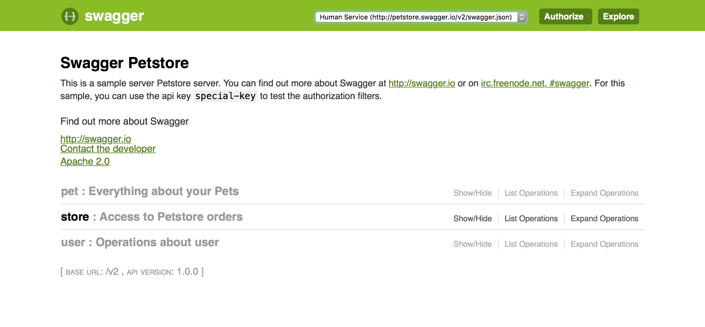

# Swagger Aggregator

  A Spring BOOT application which aggregates/consolidates all the swagger definitions usind springfox.
  This app if added to Spring BOOT based Netflix Zuul (API Gateway) will provide complete API gateway features like 
  paid product [Swagger Hub](https://swaggerhub.com)
  
  NOTE: Possible extension(s)
  1. PropertyResourceProvider can be easily extended to add all the micro services based swagger definition
     from service registry like [consul](https://www.consul.io).This can be achieved by adding Spring Cloud 
     (consul) to pom.xml using DiscoveryClient. Alternatively, one can load Swagger definition from DB also.
  2. Currently Swagger Aggregator consolidates all swagger definition defined in application.yml as shown below:
  
     ``` yaml
            documentation:
              swagger:
                services:
                  -
                    name: Pet Service
                    url: http://petstore.swagger.io/v2/swagger.json
                    version: 2.0
                  -
                    name: Human Service
                    url: http://petstore.swagger.io/v2/swagger.json
                    version: 2.0
                  -
                    name: Zoo Service
                    url: http://petstore.swagger.io/v2/swagger.json
                    version: 2.0
                  -
                    name: Food Service
                    url: http://petstore.swagger.io/v2/swagger.json
                    version: 2.0
          ```
  3. Swagger Aggregator application.yml is defined out side the application in the config folder. This provides ease in 
     changing the application properties without building application again
     
   ### Run Swagger Aggregator
    
   Use following commands to run Swagger Aggregator app:
   
   1. mvn clean install
   2. java -jar target/swagger-aggregator-0.0.1-SNAPSHOT.jar 
   
   Hit following URL to see aggregator UI:
   
   http://localhost:8000/swagger-ui.html
   
   NOTE: On top right corner in combo box, all the swagger defintion specified in applicaiton.yml will be visible
    
   
   
       
   
    
